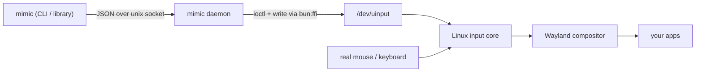

# mimic

**Drive your computer like a human.** `mimic` moves the mouse, clicks, scrolls and types
through the Linux kernel's own input subsystem — so the events are physically
indistinguishable from a real keyboard and mouse. No browser, no accessibility API,
no synthetic-event fingerprint for anti-bots to catch.

<p>
  
  
  
</p>

```sh
bun i -g mimic        # install the CLI
mimic setup           # grant uinput access (once, asks for sudo)
mimic doctor          # confirm the machine is ready

mimic move 960 540
mimic click 200 120
mimic type "hello from a real keyboard"
mimic paste "açaí, naïve, 日本語 — even unicode"
```

## Why it's undetectable

Most automation tools inject events at the application or browser layer, where they
carry tell-tale flags (`isTrusted: false`, missing timing, no device). `mimic` instead
creates **virtual input devices** with [`uinput`](https://www.kernel.org/doc/html/latest/input/uinput.html)
and feeds events into the kernel's input core. From there on, your mouse and a `mimic`
mouse travel the exact same path:



The pointer is an **absolute** device (it reports pixel coordinates, not deltas), so
there is no pointer acceleration to fight and every `move` lands exactly where asked.
Motion follows a curved, eased, slightly jittered path with human-like timing.

## Install

```sh
bun i -g mimic
mimic setup
```

`mimic setup` is idempotent. If `/dev/uinput` is already writable it does nothing;
otherwise it loads the `uinput` module (now and on boot), installs a udev rule giving
the `input` group access to the device, and adds you to that group. Log out and back
in once for the group change to take effect, then:

```sh
mimic doctor
```

## Usage

```sh
mimic shot screen.png                # screenshot the desktop
mimic move 960 540                   # glide the pointer
mimic click                          # click where the pointer is
mimic click 480 300 -b right         # right-click at a point
mimic dblclick 480 300               # double click
mimic drag 100 100 600 400           # press, move, release
mimic scroll -5                      # scroll down five notches
mimic type "git commit -m wip"       # type on the keyboard
mimic paste "anything — even 🎉"     # paste through the clipboard
mimic key ctrl+c                     # key combos
mimic where                          # -> "960 540"
mimic geometry                       # -> "1920x1080"

mimic <any command> --dry-run        # log the action without performing it
mimic daemon status|stop|log         # manage the background daemon
```

The first command starts a small background **daemon** and waits while the virtual
devices warm up (~2.5s, paid once). Every command after that is instant — the daemon
holds the devices open and tracks the cursor so motion can stay relative to where it is.

## As a library

```ts
import { call } from "mimic/src/service.ts";

await call("move", { x: 960, y: 540 });
await call("type", { text: "hello" });
const [x, y] = (await call("where")) as number[];
```

`call()` autostarts the daemon on first use and speaks the same protocol the CLI does.
For an in-process controller without the daemon, import the `Hands` class directly.

## Architecture

A handful of deep modules, each hiding one concern behind a small surface:

| module        | responsibility                                                        |
| ------------- | --------------------------------------------------------------------- |
| `sys.ts`      | the only `bun:ffi` boundary — `open` / `write` / `close` / `ioctl`    |
| `codes.ts`    | input-event constants and the character → keystroke map               |
| `uinput.ts`   | `VirtualDevice` — create, configure and feed a uinput device          |
| `hands.ts`    | human-like mouse and keyboard on top of the devices                   |
| `desktop.ts`  | screenshots and screen geometry from the Wayland environment          |
| `service.ts`  | the wire protocol, the daemon (`serve`) and the client (`call`)       |
| `system.ts`   | `mimic doctor` and `mimic setup`                                      |
| `cli.ts`      | argument parsing and dispatch                                         |

No native addons and no Python — just Bun calling libc directly.

## Verified, not assumed

Every primitive was checked against an independent oracle, not eyeballed. On KWin we
load a tiny KWin script over D-Bus and read `workspace.cursorPos` back from the journal,
so the position is reported by the **compositor itself** rather than by `mimic`:

- `move` lands pixel-exact at the requested coordinate.
- `click` activates real controls hit-tested by the compositor.
- `type` and `paste` are read back verbatim, accents and all.

## Configuration

| variable       | meaning                                  | default              |
| -------------- | ---------------------------------------- | -------------------- |
| `MIMIC_SCREEN` | override detected geometry, e.g. `1920x1080` | autodetected     |
| `MIMIC_WARMUP` | device warm-up before the first action, ms   | `2500`           |

## Requirements

- Linux with `uinput` (any modern kernel) and a Wayland session.
- [Bun](https://bun.sh) ≥ 1.1.
- A screenshot tool (`spectacle`, `grim` or `gnome-screenshot`) for `mimic shot`,
  and `wl-clipboard` for `mimic paste`. `mimic doctor` tells you what's missing.

## License

MIT © juicerq
