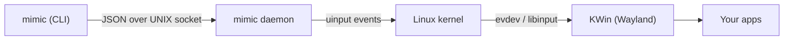
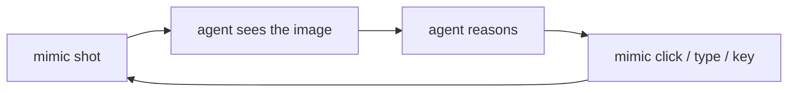

<div align="center">

# mimic

**Drive your computer like a human — kernel-level mouse, keyboard, and screen control for agents.**

[](https://kde.org/)
[](https://www.python.org/)
[-4caf50)](https://www.kernel.org/doc/html/latest/input/uinput.html)
[](LICENSE)

</div>

`mimic` lets a program — or an AI agent — control your **entire desktop** the way you do: move the mouse, click, type, scroll, and take screenshots. Input is synthesized through the Linux **`uinput`** subsystem at the kernel level, so the events are **indistinguishable from a real physical mouse and keyboard**. From the system's point of view (and from the browser's), it *is* a human at the machine.

It targets **KDE Plasma on Wayland**, where the usual X11 tools (`pyautogui`, `xdotool`) simply don't work. Cursor positioning is **absolute and pixel-exact** — `click 800 400` lands on `800, 400`, with no pointer-acceleration drift.

---

## Highlights

- 🖱️ **Whole-desktop control** — any app, not just a browser.
- 🎯 **Pixel-exact** absolute positioning (no acceleration, no DPI fuzz).
- 🧬 **Indistinguishable from hardware** — real kernel input events, no automation flags.
- 🧑 **Humanized motion** — Bézier-curved paths, jitter, and variable timing.
- ⚡ **Fast & stateful** — a daemon keeps the virtual devices warm and tracks the cursor.
- 🤖 **Agent-friendly CLI** — one discrete command per action, plus JSON batches.
- 🔒 **Safe by design** — audit log, dry-run, and an instant kill switch.
- 🪶 **Zero heavy deps** — `python-evdev` + `spectacle` (ships with KDE).

---

## How it works



**Kernel-level input.** The daemon opens `/dev/uinput` and registers three virtual
devices: an **absolute pointer**, a **scroll wheel**, and a **keyboard**. Writing to
these emits genuine kernel input events — the same path a physical USB device takes.
Nothing in the browser or the desktop can tell them apart from real hardware, because
at the OS level there is no difference.

**Why a daemon?** Creating a virtual device takes a moment (~2.5 s) before the
compositor recognizes it. A long-lived daemon pays that cost **once** at startup, then
serves every command instantly. It also keeps the **cursor position** in memory between
commands, which is what makes humanized, curved movement possible. The daemon starts
itself automatically on the first command.

**Absolute & exact.** The pointer is an absolute device, so a target coordinate maps
straight to a screen pixel — immune to the pointer-acceleration curve that distorts
relative-motion approaches. Verified empirically against KWin's own `cursorPos`.

**No root.** On a modern session, `logind` grants the active user an ACL on
`/dev/uinput`, so `mimic` runs entirely **without `sudo`**.

---

## Install

```bash
# Arch / CachyOS
sudo pacman -S --needed python-evdev wl-clipboard   # wl-clipboard is only for `paste`
# spectacle (screenshots) ships with KDE

git clone https://github.com/juicerq/mimic.git
ln -s "$PWD/mimic/bin/mimic" ~/.local/bin/mimic     # put it on your PATH
```

> Requires KDE Plasma on Wayland. `/dev/uinput` must be accessible to your user
> (default on systemd/logind sessions — no `sudo` needed).

---

## Usage

```bash
mimic shot                   # screenshot the whole screen -> prints the PNG path
mimic move 800 400           # humanized move
mimic click 800 400          # move, then click
mimic click                  # click at the current position
mimic click -b right         # right button
mimic dblclick 800 400       # double click
mimic drag 100 100 500 500   # press, move, release
mimic scroll -3              # scroll down (positive scrolls up)
mimic type "hello world"     # type (US layout, ASCII)
mimic paste "café com ç"     # type via clipboard (Unicode / accents)
mimic key ctrl+c             # key combos
mimic key enter
mimic where                  # current cursor position
mimic geometry               # screen resolution

mimic daemon status | start | stop | restart | log
```

### Command reference

| Command | Description |
| --- | --- |
| `shot [path]` | Capture the full screen to a PNG and print its path |
| `move X Y` | Move the cursor with a humanized trajectory |
| `click [X Y] [-b btn] [-n count]` | Click, optionally moving first |
| `dblclick [X Y]` | Double click |
| `drag X1 Y1 X2 Y2` | Press, move, release |
| `scroll N` | Scroll the wheel (`+` up, `-` down) |
| `type TEXT` | Type characters (US layout, ASCII) |
| `paste TEXT` | Type via clipboard — Unicode and accents |
| `key COMBO` | `enter`, `ctrl+c`, `alt+tab`, … |
| `where` / `geometry` | Cursor position / screen size |
| `run [file]` | Run a JSON list of actions (`-` for stdin) |

### Batches

```bash
echo '[
  {"action":"move","x":960,"y":540},
  {"action":"click"},
  {"action":"type","text":"hi"},
  {"action":"key","combo":"enter"}
]' | mimic run -
```

---

## The agent loop

`mimic` is built for the **observe → reason → act** loop. `shot` is the eye; the rest are the hands.



---

## Safety

`mimic` gives a program full control of your mouse and keyboard. v1 ships three guardrails:

- **Audit log** — every action is recorded to `~/.local/state/mimic/actions.log`
  (`mimic daemon log`).
- **Dry-run** — `mimic --dry-run <command>` logs the action without performing it.
- **Kill switch** — `mimic daemon stop` destroys the virtual devices instantly and
  hands control back to you. `Ctrl-C` on the daemon does the same.

> **Wayland note:** the physical pointer position can't be read globally, so the classic
> "slam the mouse into a corner to abort" failsafe isn't possible here — the kill switch
> is `mimic daemon stop`.

---

## Verified, not assumed

Every primitive was validated empirically on real hardware, not just trusted to work:

| Capability | How it was checked | Result |
| --- | --- | --- |
| `move` | KWin's `workspace.cursorPos` after each move | pixel-exact |
| `click` | clicked a dialog's OK button by its real geometry → window closed | exact |
| `type` | typed into a focused `kdialog` input box → read back | exact |
| `paste` | pasted `café com ç e ção` → read back | accents intact |

---

## Limitations

- **Single monitor.** Resolution is auto-detected via `kscreen-doctor`; override with
  `MIMIC_SCREEN=1920x1080`.
- **`type` assumes a US layout** and covers ASCII only. For accents / Unicode, use
  `paste`, which is layout-independent.
- **KDE Plasma / Wayland only** (tested on `kwin_wayland`).

---

## License

[MIT](LICENSE) © juicerq
